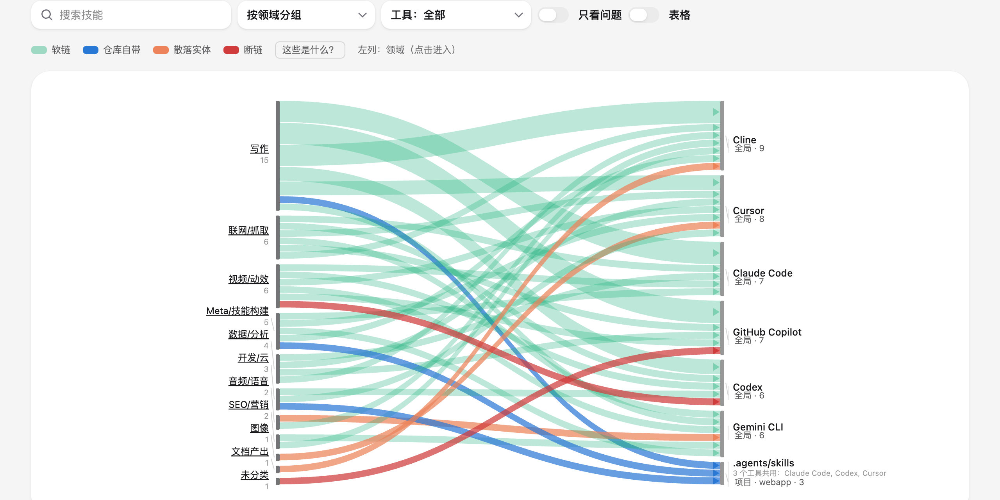
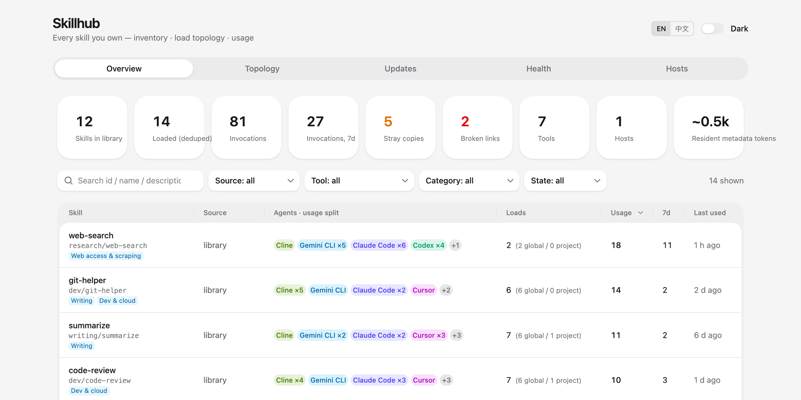
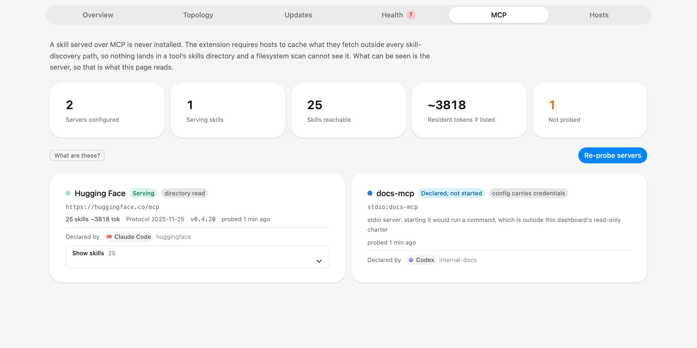

<div align="center">

<picture>
  <source media="(prefers-color-scheme: dark)" srcset="docs/assets/hero-topology-dark.png">
  
</picture>

# Skillmgmnt

**The read-only observability dashboard for your AI-agent skills.**
See every skill you own, every tool that loads it, what actually gets used — and what's silently broken.

[](LICENSE)
[](https://www.python.org)
[](web/)
[](AGENTS.md)

**English** · [简体中文](README.zh-CN.md)

<sub>Renamed from `hcodestack/skillhub` on 2026-09-18. Old links redirect and
nothing needs changing — see the [changelog](CHANGELOG.md) for what kept the old
name on purpose, and for the `SKILLHUB_*` environment variables that still work
but are deprecated.</sub>

</div>

---

Skills (`SKILL.md` folders) are how AI coding tools learn your workflows — and
they multiply fast: one library, a dozen tools, symlinks here, copies there,
leftovers everywhere. Skillmgmnt answers the four questions nobody can answer by
hand anymore:

1. **What do I have?** — a searchable catalog of your whole skills library
2. **Where is it loaded?** — which of **47+ AI tools** (Claude Code, Codex,
   Cursor, Gemini CLI, Copilot, Cline, …) load each skill, globally or
   per-project, as a symlink or a copy
3. **Is it used?** — invocation events parsed from the tools' own session logs
4. **What's broken?** — broken symlinks, stray copies, drifted duplicates,
   oversized bodies, descriptions too thin to ever trigger, and a
   deterministic **safety review** of what each skill's code actually does

## ✨ Features

| | |
|---|---|
| 🗺 **Load topology** | A three-level Sankey — domain → skill → every load site — colored by link health (symlink / repo-vendored / stray copy / broken), with drill-down and a table view |
| 🔍 **47+ tool coverage** | One scanner knows the entry directories of 47+ AI coding tools; shared directories are attributed honestly (`shared:<dir>`), never to one arbitrary tool |
| 📈 **Real usage, not vibes** | Skill invocations parsed incrementally from session logs, per tool and per skill — sortable, filterable, time-lined |
| 🩺 **Governance findings** | Broken links (with an unmounted-volume guard so one offline disk doesn't flood the page red), stray copies, content-drifted duplicates, thin descriptions, oversized bodies — each explained in place: what it is, how it happens, what to do |
| 🛡 **Deterministic safety review** | 12 regex rules with a cross-line window scan every skill's files for credential access, outbound POSTs, `curl \| sh`, eval/exec, sudo and more — no model, no API key, no network. Findings are signals with file:line evidence, not verdicts |
| 🔄 **Upstream updates** | git-backed skills that fell behind get a one-click `git pull --ff-only` (refuses dirty trees); catalog-copied skills report upstream movement |
| 📋 **Findings → action** | Export a governance report (paste it to your agent as a work order) or a reviewable remediation script whose *uncommented* commands are provably safe |
| 🤖 **MCP native** | Seven read-only tools let Claude Code / Codex query the hub directly: *"which skills does nobody use?" "is X safe?" "fetch the remediation plan"* — your agent executes, with your confirmation, on the machine where the files are |
| 🖥 **Runs anywhere** | One machine (built-in self-reporter, zero cron), Docker, or a LAN hub on a home server/NAS aggregating every machine you work on |
| 🔌 **Sees skills served over MCP** | A skill served over MCP ([SEP-2640](https://github.com/modelcontextprotocol/modelcontextprotocol/pull/2640)) is never installed — the extension requires hosts to cache it outside every skill-discovery path, so a scanner cannot see it. Skillmgmnt reads which servers your tools point at, asks the ones it can, and reports what they serve and what it costs you in context |
| 🌍 **English and 中文** | The UI ships in English and switches to Simplified Chinese from the header — including the text the server composes (health findings, the exported governance report). One catalog per side, two strings per message, so translations cannot drift |
| 🔒 **Read-only by design** | Skillmgmnt observes; your existing workflow keeps managing. It can never fight your tooling or move your files |

<div align="center">
<picture>
  <source media="(prefers-color-scheme: dark)" srcset="docs/assets/overview-dark.png">
  
</picture>
<br><sub>The overview: problem tiles deep-link straight into their findings.</sub>
</div>

## 🚀 Quick start

| You have… | Mode | Setup |
|---|---|---|
| one machine | **A · Local** | the wizard below — no cron, no Docker |
| one machine + Docker | **B · Docker** | container + a tiny host-side reporter |
| several machines / NAS | **C · LAN hub** | server on the always-on box, reporters everywhere |

### Mode A — local (recommended)

```bash
curl -fsSL https://raw.githubusercontent.com/hcodestack/skillhub/main/install.sh | bash
```

or, from a clone:

```bash
git clone https://github.com/hcodestack/skillmgmnt.git ~/skillhub
cd ~/skillhub && ./setup.sh
```

The wizard shows which AI tools it detected on your machine, asks where your
skills library is (any folder tree containing `SKILL.md` directories — no
manifest, no naming convention), builds the UI once, installs the `skillhub`
command, and offers start-at-login plus one-keystroke MCP registration with
Claude Code. Bilingual, five steps, no questions it can answer itself.

Day-to-day:

```bash
skillhub          # start (if needed) and open the dashboard
skillhub status   # running? watching which library?
skillhub update   # pull the latest, rebuild if needed
skillhub stop
```

A built-in self-reporter scans this machine's AI tools every 15 minutes
(first run backfills usage history) — nothing else to schedule. Its runs
appear on the health page like any background job, so failures are loud.

*Prerequisites: Python 3.11+ with [uv](https://docs.astral.sh/uv); Node with
pnpm only for the one-time UI build. No skills library yet? `./quickstart.sh`
boots against the bundled demo library.*

### 🤖 Don't like terminals? Let your agent install it

Skillmgmnt ships an **agent runbook** ([AGENTS.md](AGENTS.md)) that Claude
Code, Codex and similar tools follow: what to check, what to ask you (in your
language), how to find your skills library, the exact non-interactive install,
and how to *prove* the result before reporting back. Paste this into your
agent:

> Install Skillmgmnt on this machine: clone
> `https://github.com/hcodestack/skillmgmnt` to `~/skillhub`, then read
> `AGENTS.md` in the checkout and follow its Install runbook. Ask me only
> what it tells you to ask. When you're done, show me what my dashboard says.

Because setup registers the hub as an MCP tool, the same agent can answer
*"which skills does nobody use?"* or *"clean up my broken links"* the moment
the install finishes.

### Mode B — Docker on one machine

```bash
cd web && pnpm build
docker build -f deploy/Dockerfile.release -t skillhub:latest .
# edit deploy/docker-compose.yml: mount your library at /library
docker compose -f deploy/docker-compose.yml up -d

# a container can't scan your host $HOME — run the reporter on the host:
reporter/install-launchd.sh http://127.0.0.1:8787     # macOS, every 15 min
reporter/install-cron.sh    http://127.0.0.1:8787     # Linux, every 15 min
```

### Mode C — LAN hub (home server / NAS)

Run Mode B on the always-on box, then on **each** machine you work on:

```bash
reporter/install-launchd.sh http://<hub-host>:8787    # or install-cron.sh
```

Every machine appears on the **Hosts** tab; findings aggregate across all of
them. Add `:ro` to the library mount unless you want one-click git updates.

## 🧭 How it works

```
Any host (laptop, home server, NAS)            each machine you work on
┌──────────────────────────────┐  HTTP POST   ┌──────────────────────────────┐
│ server/  FastAPI + SQLite    │ ◄─────────── │ reporter/skillhub_report.py  │
│  · scans your skills library │  /api/v1/    │  · scans 47+ tool entry dirs │
│  · background: upstream      │   report     │  · parses session logs       │
│    checks, safety review,    │              │    incrementally (cursors)   │
│    MCP skill discovery       │              │  · reads MCP server configs  │
│  · web/ SPA (React 19)       │              │  · offline spool + catch-up  │
└──────────────────────────────┘              │  pure stdlib, zero deps      │
   │    ▲                                     └──────────────────────────────┘
   │    └─────────────────────────────────────┌──────────────────────────────┐
   │          HTTP GET  /api/v1/*             │ mcp/skillhub_mcp.py          │
   │                                          │ read-only, stdio ↔ your agent│
   │                                          └──────────────────────────────┘
   └──► the MCP servers your tools already point at:
        initialize + skills/list only, anonymous, never stdio
```

The server is the only required part. Skill ids are simply paths relative to
your library root — the hub scans for `SKILL.md` folders itself; an external
index file is optional for setups that already maintain a catalog.

Everything above reads. The single outbound path is the MCP probe, and it is
bounded to two read-only methods; see [Skills served over MCP](#-skills-served-over-mcp).

## ⚙️ Configuration

Everything is environment variables; only the first is required.

| Variable | Meaning |
|---|---|
| `SKILLMGMNT_LIBRARY_ROOT` | your skills library directory (scanned recursively for `SKILL.md`) |
| `SKILLMGMNT_LIBRARY_INDEX` | *optional*: pre-built JSON catalog used instead of scanning; re-synced on mtime change |
| `SKILLMGMNT_LIBRARY_SUBDIRS` | *optional*, comma-separated: restrict lookup to these first-level subdirs |
| `SKILLMGMNT_INSTALLER_SUBDIR` | *optional*: one subdir owned by an installer CLI (hub labels, never updates) |
| `SKILLMGMNT_ENTITY_WHITELIST` | *optional*: `agent:entry,…` pairs that are legitimately real dirs in tool entry dirs |
| `SKILLMGMNT_PROVENANCE_FILE` | *optional*: JSON mapping skill families to upstream repos (schema in `core/provenance.py`) |
| `SKILLMGMNT_LIBRARY_DISPLAY_ROOT` | library path as *users* see it, for copy-pasteable commands when the hub runs in Docker |
| `SKILLMGMNT_SELF_REPORT` | `auto` (default) / `1` / `0` — the built-in self-reporter; auto = on for source checkouts outside containers |
| `SKILLMGMNT_DB` / `SKILLMGMNT_HOST` / `SKILLMGMNT_PORT` / `SKILLMGMNT_STATIC` | storage & serving knobs |

> **Note** · The dashboard has no authentication — it binds to `127.0.0.1` by
> default. Set `SKILLMGMNT_HOST=0.0.0.0` only on a network you trust.

> **Renamed from `SKILLHUB_*`** · This project used to be called Skillhub, and
> the old prefix still works: each variable is read as `SKILLMGMNT_<name>` first
> and falls back to `SKILLHUB_<name>`. Existing compose files and shell profiles
> keep working, and the server prints a one-line notice at startup naming any
> old variable it is still reading. The fallback is deprecated and will be
> removed in a release that says so.

## 🔌 Skills served over MCP

Skills no longer only live on disk. [SEP-2640][sep] merged the Skills extension
into MCP on 2026-09-13, so a server can serve skills alongside its tools. The
extension also requires a host to cache what it fetches **outside every
skill-discovery path** — so nothing lands in a tool's skills directory, and a
scanner like this one is blind to those skills by design.

Left alone, that turns into the failure this project exists to catch: the
dashboard reporting a confident number while the agent quietly runs skills it
has no idea exist. The **MCP** tab closes the gap.

**These skills are reachable, not loaded.** They have no local footprint and no
link state, so they get their own vocabulary rather than a fifth kind of link.
What they cost is their name and description in every turn's context, and
nothing else until one is actually used — so that number leads, next to the
resident cost of your local skills on the overview.

<div align="center">
<picture>
  <source media="(prefers-color-scheme: dark)" srcset="docs/assets/mcp-dark.png">
  
</picture>
<br><sub>The MCP tab: what each server serves, what it costs in context, and which probes were refused on purpose.</sub>
</div>

### What it does, and what it refuses to do

Only `initialize` and `skills/list` are ever sent, both read-only. No tool is
called and no skill content is fetched: the listing is a complete manifest, and
the extension designed it to be enough. Three boundaries hold the rest:

| Boundary | Why |
|---|---|
| **Credentials are never read** | An `env` or `headers` block in your MCP config becomes a single boolean. The values never leave the function that saw them, and the probe is always anonymous. A server that wants authentication is recorded as wanting it, and left alone. |
| **stdio servers are never started** | Enumerating one means spawning a process, and spawning a process is running a command on your machine rather than observing it. |
| **Loopback endpoints are never probed** | `localhost` names a different machine to everyone who reads it. A hub connecting to one would reach some unrelated service on its own box, not the server that was meant. |

Six endpoint states, two of them deliberate refusals rather than failures:

| State | Meaning |
|---|---|
| **Serving** | Declares the extension and enumerated what it serves |
| **Serving, not enumerable** | Declares it but returns no listing — allowed, for catalogs that are large, generated on demand, or behind a gateway |
| **No skills extension** | An MCP server, but tools and resources only |
| **Needs authentication** | Deliberately not probed |
| **Declared, not started** | A stdio server, deliberately not started |
| **Unreachable** | Configured here, and the probe could not complete |

### What it finds

Five health findings come from reconciling the served view against the
filesystem one:

- **Name collisions** with a local skill. The spec calls this an impersonation
  surface and asks hosts to surface it, since a name binds to whatever bytes its
  origin currently serves and carries no authorship.
- **Entries that cannot be content-bound**, because the listing is `dynamic` or
  a file is missing its digest or size. Approval is supposed to pin to an exact
  file set; these cannot.
- **Skills over the protocol's limits** of 512 files or 16 MiB, which are not
  guaranteed to load in any conforming host.
- **Frontmatter asking for wider permissions.** A remote server writing
  `allowed-tools` is requesting access on your machine, not describing its own.
- **Servers configured but not reachable.**

No configuration is needed. Servers are discovered from the configs your tools
already keep, and probing runs as a background job, never in a request.

> **Ecosystem status** · The extension is `final` but young. The official SDKs
> are still landing support and few hosts consume it yet, so expect most of your
> servers to report *no skills extension* for now. This was verified against
> [Hugging Face's MCP server][hf], which implements the extension in full.

## 🌍 Language

The dashboard is **English by default** and switches to Simplified Chinese from
`EN | 中文` in the header. The choice is remembered per browser
(`localStorage['skillhub-lang']`), and `?lang=zh` / `?lang=en` sets it from a
link — handy for sharing one view with a colleague who reads the other language.

The switch covers the text the *server* composes too — health-finding titles and
hints, background-job names, safety-rule rationales, and the exported governance
report and remediation script — because every request carries the current
language and the language is part of the client-side cache key.

**Adding or changing wording** (and adding a third language) happens in two
catalogs, one per side:

| | |
|---|---|
| `web/src/lib/i18n.tsx` | everything rendered in the browser. Each entry is one message with both strings side by side: `'nav.health': ['Health', '健康']`. Components read it with `const t = useT()`; keys are typed, so a typo fails `pnpm typecheck` |
| `server/skillhub_server/core/i18n.py` | text the API composes. Same shape: `"he.jobs.title": ("Background jobs", "后台任务")`, resolved per request from `?lang=` |

Keeping both strings in one entry is deliberate: a translation sits on the line
below the text it translates, so it cannot silently fall behind an edit.

What lands in the database is a **key, never display text** — domain tags
(`video`, `cn-social`, …) and the synthetic `standalone` / `unmanaged` /
`external` families are rendered per language in the browser, and a safety
finding's category and rationale are resolved from its rule id at read time, so
rewording a rule or switching language needs no rescan. Your own directory names
(`Cloudflare`, `my-stuff`, …) are always shown verbatim.

## 🛡 Why the safety review exists

Every skill is code someone else wrote that your agent runs **with your
permissions**. On every sync, Skillmgmnt runs a deterministic red-flag review
over every file a skill ships: reading agent memory/credential files, browser
session access, raw-IP endpoints, `curl | sh`, eval/exec on external input,
sudo, out-of-tree writes, outbound POSTs, unpinned installs,
base64-decode-then-run. Findings carry file, line, excerpt and rationale —
signals for a human (or your agent) to judge, never silent verdicts.

## 🧱 Deliberate non-features

- **No built-in model evaluation** — skill quality grading belongs to tools
  purpose-built for it; the hub generates a ready-to-paste evaluation prompt
  instead of embedding an LLM client (no keys, no bills)
- **No usage trend charts** until the data earns them — with sparse logs a
  trend line is theater; the sortable table tells the truth
- **No chat memory** — transcripts already live where your tools keep them
- **No write operations on your skills** — the one hub-side write is the
  optional git fast-forward button, and the MCP surface is read-only

## 📚 References

Version history is in the [changelog](CHANGELOG.md).

**The Skills extension**

- [SEP-2640: Skills Extension][sep] — the proposal, merged `final` on 2026-09-13
- [modelcontextprotocol/ext-skills][ext] — the stable specification, its design
  rationale, and the running list of implementations
- [Extension Support Matrix][matrix] — which MCP clients consume which official
  extensions
- [Agent Skills specification][agentskills] — the skill format itself, which
  SEP-2640 delegates to rather than redefining
- [Model Context Protocol][mcp] — the base protocol

**Prior art this project builds on**

- [qufei1993/skills-hub][skillshub] (MIT) — the tool directory table behind the
  47-tool coverage, the `SKILL.md` validity check, and the content-hash approach
  to duplicate and drift detection. Its UI guidelines are also why mutually
  exclusive views here are segmented controls rather than switches.
- [@lobehub/icons-static-svg][lobehub] (MIT) — the tool brand marks

[sep]: https://github.com/modelcontextprotocol/modelcontextprotocol/pull/2640
[ext]: https://github.com/modelcontextprotocol/ext-skills
[matrix]: https://modelcontextprotocol.io/extensions/client-matrix
[agentskills]: https://agentskills.io/specification
[mcp]: https://modelcontextprotocol.io
[hf]: https://github.com/huggingface/hf-mcp-server
[skillshub]: https://github.com/qufei1993/skills-hub
[lobehub]: https://github.com/lobehub/lobe-icons

## 📄 License

[MIT](LICENSE) © 2026 [hcodestack](https://github.com/hcodestack)
